# NCERT: Class 11 Physics — Chapter 1
# Units and Measurement (मात्रक एवं मापन)

> **NCERT Class 11 Physics** | **Digital Study & NEET Core Edition** | Clean Vector Diagrams, KaTeX Equations, Visual Mind Map & Formula Sheets

---

## 📑 Quick Navigation
* [🗺️ Bird's Eye View Chapter Roadmap](#1-birds-eye-view-chapter-roadmap)
* [🧠 Visual Concept Mind Map](#2-visual-concept-mind-map)
* [⚡ Important Points, Formulas & NEET Traps](#3-important-points-formulas--neet-traps)
* [📖 Detailed NCERT Summary & Topic Breakdown](#4-detailed-ncert-summary--comprehensive-analysis)
* [🎯 Solved NCERT Exercises & Numericals](#5-solved-ncert-exercises--numericals)

---

# 🗺️ 1. Bird's Eye View Chapter Roadmap

### 🏛️ 1.1 Four-Pillar Chapter Architecture
The entire chapter is organized into 4 foundational conceptual pillars:

| Conceptual Pillar | Core Topics & Content | NEET / Board Weightage |
| :--- | :--- | :--- |
| **1. Systems of Units** | SI System, 7 Base Units, 2 Supplementary Units, BIPM 2018 Definitions, Practical Astronomical Units (AU, ly, pc). | Foundational (1 Question Likely) |
| **2. Instruments & Measurement** | Parallax Method, Vernier Caliper, Screw Gauge, Least Count (LC) & Zero Error Corrections. | High-Yield (Experimental Physics) |
| **3. Errors & Significant Figures** | Systematic vs Random Errors, Absolute, Relative & % Errors, Combination of Errors (Power Rule), Sig Fig Rules & Rounding Off. | Most Critical (1 Mandatory NEET Question) |
| **4. Dimensional Analysis** | Dimensional Formulae, Principle of Homogeneity ($LHS = RHS$), 3 Applications, Dimensional Limitations. | High-Yield (1-2 NEET Questions annually) |

---

### 🎯 1.2 NEET / JEE Exam Blueprint & Trends
* **Expected Question Weightage:** 1 to 2 Questions (**4 to 8 Marks**).
* **Top Recurring Exam Traps & Patterns:**
  1. **Combination of Errors in Powers:** $Z = \frac{A^p B^q}{C^r} \implies \frac{\Delta Z}{Z} = p\frac{\Delta A}{A} + q\frac{\Delta B}{B} + r\frac{\Delta C}{C}$.
  2. **Universal Physical Constants Matching:** Planck's constant ($h$), Gravitational constant ($G$), Permittivity ($\epsilon_0$), Permeability ($\mu_0$).
  3. **Dimensional Homogeneity Equations:** Finding dimensions of constants in $v = at + \frac{b}{t+c}$ or $(P + a/V^2)(V - b) = RT$.
  4. **Vernier & Screw Gauge Readings:** Zero error sign conventions (+ve is subtracted, -ve is added).

---

# 🧠 2. Visual Concept Mind Map

```mermaid
graph TD
    classDef root fill:#4f46e5,stroke:#3730a3,stroke-width:3px,color:#ffffff,font-weight:bold;
    classDef branch fill:#e0e7ff,stroke:#6366f1,stroke-width:2px,color:#1e1b4b,font-weight:bold;
    classDef leaf fill:#f8fafc,stroke:#94a3b8,stroke-width:1.5px,color:#0f172a;
    classDef trap fill:#fee2e2,stroke:#ef4444,stroke-width:2px,color:#991b1b,font-weight:bold;

    Root["⚛️ Chapter 1: Units and Measurement<br/>(Class 11 Physics)"]:::root

    Root --> B1["1. Systems of Units"]:::branch
    Root --> B2["2. Instruments & LC"]:::branch
    Root --> B3["3. Errors & Sig Figs"]:::branch
    Root --> B4["4. Dimensional Analysis"]:::branch

    B1 --> B1a["SI Base Units (7)<br/>m, kg, s, A, K, mol, cd"]:::leaf
    B1 --> B1b["Supplementary Units (2)<br/>Plane Angle (rad), Solid Angle (sr)"]:::leaf
    B1 --> B1c["Astronomical Units<br/>1 AU, 1 ly, 1 pc"]:::leaf

    B2 --> B2a["Vernier Calipers<br/>LC = 1 MSD - 1 VSD"]:::leaf
    B2 --> B2b["Screw Gauge<br/>LC = Pitch / Circular Divisions"]:::leaf
    B2 --> B2c["⚠️ Zero Error Rule<br/>True Reading = Observed - (± Zero Error)"]:::trap

    B3 --> B3a["Error Types<br/>Systematic vs Random Errors"]:::leaf
    B3 --> B3b["⚠️ Error in Powers<br/>Fractional errors always add: p(ΔA/A) + q(ΔB/B) + r(ΔC/C)"]:::trap
    B3 --> B3c["Significant Figures<br/>Non-zero, Trapped, Trailing Zeros"]:::leaf
    B3 --> B3d["Rounding Off Rules<br/>Greater than 5, Less than 5, Even-Odd Rule"]:::leaf

    B4 --> B4a["Principle of Homogeneity<br/>Dimensions of LHS = Dimensions of RHS"]:::leaf
    B4 --> B4b["3 Applications<br/>Equation check, Unit conversion, Deducing formula"]:::leaf
    B4 --> B4c["⚠️ Limitations<br/>Cannot find dimensionless constants (k, 2π), sinθ, e^x, ln(x)"]:::trap
```

---

# ⚡ 3. Important Points, Formulas & NEET Traps

### 📝 3.1 Master Formula Sheet

| Concept | Mathematical Formula | Key Note & Tip |
| :--- | :--- | :--- |
| **Fundamental Measurement Law** | $Q = n_1 u_1 = n_2 u_2 \implies n \propto \frac{1}{u}$ | Larger unit corresponds to smaller numerical value. |
| **Plane Angle ($d\theta$)** | $d\theta = \frac{ds}{r}\text{ rad}$ | Unit is radian ($\text{rad}$), but **dimensionless** ($[M^0 L^0 T^0]$). |
| **Solid Angle ($d\Omega$)** | $d\Omega = \frac{dA}{r^2}\text{ sr}$ | Unit is steradian ($\text{sr}$), also **dimensionless** ($[M^0 L^0 T^0]$). |
| **Vernier Least Count (LC)** | $\text{LC} = 1\text{ MSD} - 1\text{ VSD} = \frac{1\text{ MSD}}{N}$ | When $N\text{ VSD} = (N-1)\text{ MSD}$. |
| **Screw Gauge Least Count** | $\text{LC} = \frac{\text{Pitch}}{\text{Total Circular Scale Divisions (N)}}$ | Standard: $\text{Pitch} = 1\text{ mm}$, $N = 100 \implies \text{LC} = 0.01\text{ mm}$. |
| **True Correct Reading** | $\text{Reading} = \text{MSR} + (\text{VSR} \times \text{LC}) - (\pm e)$ | Positive error is subtracted; Negative error is added. |
| **Mean Absolute Error** | $\Delta a_{\text{mean}} = \frac{1}{n}\sum_{i=1}^n |\Delta a_i|$ | Absolute errors are always **positive (+)**. |
| **Relative & Percentage Error** | $\text{Relative} = \frac{\Delta a_{\text{mean}}}{a_{\text{mean}}}$, $\text{Percentage} = \text{Relative} \times 100\%$ | Errors always compound and accumulate. |
| **Error in Powers (Master Rule)** | If $Z = \frac{A^p B^q}{C^r}$, then $\frac{\Delta Z}{Z} = p\frac{\Delta A}{A} + q\frac{\Delta B}{B} + r\frac{\Delta C}{C}$ | Fractional errors are **always added**, even for terms in the denominator! |
| **Unit Conversion Law** | $n_2 = n_1 \left[\frac{M_1}{M_2}\right]^a \left[\frac{L_1}{L_2}\right]^b \left[\frac{T_1}{T_2}\right]^c$ | $1\text{ J} = 10^7\text{ erg}$, $1\text{ N} = 10^5\text{ dyn}$. |

---

### 📊 3.2 Top 25 Most Frequent NEET / JEE Dimensions

| Physical Quantity | Defining Relation | SI Unit | Dimensional Formula |
| :--- | :--- | :--- | :--- |
| **Velocity / Speed** | Displacement / Time | $\text{m}\cdot\text{s}^{-1}$ | $[M^0 L T^{-1}]$ |
| **Acceleration** | Change in velocity / Time | $\text{m}\cdot\text{s}^{-2}$ | $[M^0 L T^{-2}]$ |
| **Force ($F$)** | $\text{Mass} \times \text{Acceleration}$ | $\text{N} = \text{kg}\cdot\text{m}\cdot\text{s}^{-2}$ | $[M L T^{-2}]$ |
| **Work / Energy / Heat** | $\text{Force} \times \text{Displacement}$ | $\text{J} = \text{kg}\cdot\text{m}^2\cdot\text{s}^{-2}$ | $[M L^2 T^{-2}]$ |
| **Power ($P$)** | Work / Time | $\text{W} = \text{J}\cdot\text{s}^{-1}$ | $[M L^2 T^{-3}]$ |
| **Pressure / Stress** | Force / Area | $\text{Pa} = \text{N}\cdot\text{m}^{-2}$ | $[M L^{-1} T^{-2}]$ |
| **Linear Momentum / Impulse** | $\text{Mass} \times \text{Velocity}$ | $\text{kg}\cdot\text{m}\cdot\text{s}^{-1}$ | $[M L T^{-1}]$ |
| **Torque ($\tau$)** | $\text{Force} \times \text{Perpendicular distance}$ | $\text{N}\cdot\text{m}$ | $[M L^2 T^{-2}]$ |
| **Moment of Inertia ($I$)** | $\text{Mass} \times \text{Radius}^2$ | $\text{kg}\cdot\text{m}^2$ | $[M L^2 T^0]$ |
| **Angular Momentum ($L$)** | $r \times p = I\omega$ | $\text{kg}\cdot\text{m}^2\cdot\text{s}^{-1}$ | $[M L^2 T^{-1}]$ |
| **Planck's Constant ($h$)** | $E = h\nu \implies h = E/\nu$ | $\text{J}\cdot\text{s}$ | $[M L^2 T^{-1}]$ (Same as Angular Momentum) |
| **Universal Gravitational Constant ($G$)** | $F = \frac{G m_1 m_2}{r^2}$ | $\text{N}\cdot\text{m}^2\cdot\text{kg}^{-2}$ | $[M^{-1} L^3 T^{-2}]$ |
| **Coefficient of Viscosity ($\eta$)** | $F = 6\pi \eta r v$ | $\text{Pa}\cdot\text{s}$ | $[M L^{-1} T^{-1}]$ |
| **Surface Tension ($T$)** | Force / Length | $\text{N}\cdot\text{m}^{-1}$ | $[M L^0 T^{-2}]$ |
| **Permittivity of Free Space ($\epsilon_0$)** | $F = \frac{q_1 q_2}{4\pi\epsilon_0 r^2}$ | $\text{C}^2\cdot\text{N}^{-1}\cdot\text{m}^{-2}$ | $[M^{-1} L^{-3} T^4 A^2]$ |
| **Permeability of Free Space ($\mu_0$)** | $c = \frac{1}{\sqrt{\mu_0\epsilon_0}}$ | $\text{T}\cdot\text{m}\cdot\text{A}^{-1}$ | $[M L T^{-2} A^{-2}]$ |
| **Electric Potential ($V$)** | Work / Charge ($W/q$) | $\text{V} = \text{J}\cdot\text{C}^{-1}$ | $[M L^2 T^{-3} A^{-1}]$ |
| **Capacitance ($C$)** | Charge / Potential ($Q/V$) | $\text{F} = \text{C}\cdot\text{V}^{-1}$ | $[M^{-1} L^{-2} T^4 A^2]$ |
| **Electric Resistance ($R$)** | Potential / Current ($V/I$) | $\Omega = \text{V}\cdot\text{A}^{-1}$ | $[M L^2 T^{-3} A^{-2}]$ |
| **Self / Mutual Inductance ($L, M$)** | $e = -L \frac{dI}{dt}$ | $\text{H} = \text{V}\cdot\text{s}\cdot\text{A}^{-1}$ | $[M L^2 T^{-2} A^{-2}]$ |
| **Magnetic Field ($B$)** | $F = q v B \implies B = F/(qv)$ | $\text{T} = \text{Wb}\cdot\text{m}^{-2}$ | $[M L^0 T^{-2} A^{-1}]$ |
| **Boltzmann Constant ($k_B$)** | Energy / Temperature | $\text{J}\cdot\text{K}^{-1}$ | $[M L^2 T^{-2} K^{-1}]$ |
| **Universal Gas Constant ($R$)** | $PV = nRT \implies R = PV/(nT)$ | $\text{J}\cdot\text{mol}^{-1}\cdot\text{K}^{-1}$ | $[M L^2 T^{-2} K^{-1} \text{mol}^{-1}]$ |
| **Stefan-Boltzmann Constant ($\sigma$)** | $E = \sigma T^4$ ($\text{Energy}/\text{Area}\cdot\text{Time}$) | $\text{W}\cdot\text{m}^{-2}\cdot\text{K}^{-4}$ | $[M L^0 T^{-3} K^{-4}]$ |

---

### 👯 3.3 Dimensionally Equivalent Pairs (Same Dimensions)
* **$[M L^2 T^{-2}]$:** Work = Kinetic Energy = Potential Energy = Torque = Heat.
* **$[M L T^{-1}]$:** Linear Momentum = Impulse.
* **$[M L^{-1} T^{-2}]$:** Pressure = Stress = Young's Modulus = Bulk Modulus = Shear Modulus = Energy Density.
* **$[M L^2 T^{-1}]$:** Planck's Constant ($h$) = Angular Momentum ($L$).
* **$[M L^0 T^{-2}]$:** Surface Tension = Spring Constant ($k$) = Surface Energy per unit area.
* **$[T^{-1}]$:** Frequency = Angular Velocity = Decay Constant ($\lambda$) = Velocity Gradient.
* **$[T]$ (Time equivalent):** $RC$ (Resistance $\times$ Capacitance) = $\frac{L}{R}$ (Inductance / Resistance) = $\sqrt{LC}$.
* **Dimensionless ($[M^0 L^0 T^0]$):** Plane Angle, Solid Angle, Refractive Index, Relative Density, Strain, Coefficient of Friction, Poisson's Ratio ($\sigma$), $\sin\theta$, $e^x$, $\ln x$.

---

### ⚠️ 3.4 NEET Exam Traps & Common Blunders

> [!CAUTION] **Trap 1: Never subtract errors in division or subtraction!**
> If $Z = A / B$, the maximum relative error is $\frac{\Delta Z}{Z} = \frac{\Delta A}{A} + \frac{\Delta B}{B}$. Errors always accumulate and are strictly added!

> [!WARNING] **Trap 2: Dimensionless does not mean Unitless!**
> Plane angle (radian) and Solid angle (steradian) have units, but they are completely dimensionless ($[M^0 L^0 T^0]$). However, a unitless quantity is **always dimensionless** (e.g., refractive index, relative permeability).

> [!IMPORTANT] **Trap 3: Zero Error Correction Signs:**
> * **Positive Zero Error (+ve):** Zero of vernier/circular scale is ahead $\implies$ Must be **subtracted** from final reading ($\text{True} = \text{Observed} - e$).
> * **Negative Zero Error (-ve):** Zero is behind $\implies$ Must be **added** to final reading ($\text{True} = \text{Observed} - (-e) = \text{Observed} + e$).

---

# 📖 4. Detailed NCERT Summary & Comprehensive Analysis

### 1.1 Introduction & Measurement Basics
Measurement of any physical quantity involves comparison with a basic, arbitrarily chosen, internationally accepted reference standard called a **unit**.
$$\text{Physical Quantity } Q = n \times u$$
Since the quantity remains constant regardless of the chosen unit:
$$n_1 u_1 = n_2 u_2 \implies n \propto \frac{1}{u}$$
A larger unit corresponds to a smaller numerical value (e.g., $1\text{ m} = 100\text{ cm} = 1000\text{ mm}$).

---

### 1.2 The International System of Units (SI)
Adopted by the 14th General Conference on Weights and Measures (1971) and updated in 2018 with fixed universal constants.

#### The 7 Base Units & 2 Supplementary Units:
1. **Length:** Metre ($\text{m}$) — Defined by fixing the speed of light $c = 299\,792\,458\text{ m}\cdot\text{s}^{-1}$.
2. **Mass:** Kilogram ($\text{kg}$) — Defined by fixing Planck's constant $h = 6.62607015 \times 10^{-34}\text{ J}\cdot\text{s}$.
3. **Time:** Second ($\text{s}$) — Defined by the caesium-133 frequency $\Delta\nu_{\text{Cs}} = 9\,192\,631\,770\text{ Hz}$.
4. **Electric Current:** Ampere ($\text{A}$) — Defined by the elementary charge $e = 1.602176634 \times 10^{-19}\text{ C}$.
5. **Thermodynamic Temperature:** Kelvin ($\text{K}$) — Defined by Boltzmann constant $k = 1.380649 \times 10^{-23}\text{ J}\cdot\text{K}^{-1}$.
6. **Amount of Substance:** Mole ($\text{mol}$) — Contains exactly $6.02214076 \times 10^{23}$ elementary entities (Avogadro constant $N_A$).
7. **Luminous Intensity:** Candela ($\text{cd}$) — Defined by luminous efficacy of $540 \times 10^{12}\text{ Hz}$ radiation.

**Supplementary Units:**
* **Plane Angle ($d\theta$):** $d\theta = \frac{ds}{r}\text{ rad}$ (Radian).
* **Solid Angle ($d\Omega$):** $d\Omega = \frac{dA}{r^2}\text{ sr}$ (Steradian). Whole sphere $= 4\pi\text{ sr}$.

  

    
  

  

    

      <strong>Figure 1.1:</strong> Description of (a) Plane angle $d\theta = \frac{ds}{r}\text{ rad}$ and (b) Solid angle $d\Omega = \frac{dA}{r^2}\text{ sr}$.
    

  

---

### 1.3 Astronomical & Microscopic Units
* **1 Astronomical Unit (1 AU):** $1.496 \times 10^{11}\text{ m}$ (Mean Earth-Sun distance).
* **1 Light Year (1 ly):** $9.46 \times 10^{15}\text{ m}$ (Distance travelled by light in vacuum in 1 year).
* **1 Parsec (1 pc):** $3.08 \times 10^{16}\text{ m} = 3.26\text{ ly}$ (Distance subtending 1 arcsecond by 1 AU arc).
* Relation: $1\text{ pc} > 1\text{ ly} > 1\text{ AU}$.
* Microscopic: $1\text{ Å} = 10^{-10}\text{ m}$, $1\text{ fermi} = 10^{-15}\text{ m}$.

---

### 1.4 Errors in Measurement
1. **Systematic Errors:** Predictable, unidirectional (+ve or -ve).
   * *Instrumental errors:* Zero error, calibration flaws.
   * *Imperfection in experimental technique:* Temperature/wind effects.
   * *Personal errors:* Parallax, faulty viewing angles.
2. **Random Errors:** Unpredictable, fluctuating.
   * Minimized by taking arithmetic mean of $n$ observations:
     $$a_{\text{mean}} = \frac{a_1 + a_2 + \dots + a_n}{n}$$

#### Error Formulations:
* **Absolute Error:** $\Delta a_i = |a_{\text{mean}} - a_i|$ (always positive).
* **Mean Absolute Error:** $\Delta a_{\text{mean}} = \frac{1}{n}\sum |\Delta a_i|$.
* **Relative Error:** $\frac{\Delta a_{\text{mean}}}{a_{\text{mean}}}$.
* **Percentage Error:** $\% \text{ Error} = \frac{\Delta a_{\text{mean}}}{a_{\text{mean}}} \times 100\%$.

---

### 1.5 Significant Figures & Rounding Off Rules
1. All non-zero digits are significant ($4382 \to 4$).
2. All zeros between two non-zero digits are significant ($4005 \to 4$).
3. If number $< 1$, zeros to the right of decimal and left of first non-zero digit are not significant ($0.0025 \to 2$).
4. Terminal zeros in a number with decimal are significant ($3.500 \to 4$).
5. Terminal zeros in an integer without decimal are not significant ($1500 \to 2$). However, scientific notation eliminates ambiguity ($1.500 \times 10^3 \to 4$).

#### Rounding Off Rules:
* Drop digit $> 5 \implies$ Preceding digit $+1$ ($4.76 \to 4.8$).
* Drop digit $< 5 \implies$ Preceding digit unchanged ($4.74 \to 4.7$).
* Drop digit $= 5$ followed by non-zero digits $\implies$ Preceding digit $+1$ ($4.752 \to 4.8$).
* Drop digit $= 5$ followed by zeros only:
  * If preceding digit is **odd**, $+1$ ($3.750 \to 3.8$).
  * If preceding digit is **even**, unchanged ($3.650 \to 3.6$).

---

### 1.6 Dimensional Analysis & Applications
Physical quantity in terms of base dimensions:
$$[Q] = [M^a L^b T^c A^d K^e \text{mol}^f \text{cd}^g]$$

#### Principle of Homogeneity:
In any valid physical equation, every term on both sides must have identical dimensions:
$$\text{Dim}(LHS) = \text{Dim}(RHS)$$

#### 3 Core Applications:
1. **Checking Dimensional Consistency:**
   In $s = ut + \frac{1}{2}at^2$: $[s] = [L]$, $[ut] = [L]$, $\left[\frac{1}{2}at^2\right] = [L]$. Dimensionally consistent.
2. **Converting Units Across Systems:**
   $n_2 = n_1 \left[\frac{M_1}{M_2}\right]^a \left[\frac{L_1}{L_2}\right]^b \left[\frac{T_1}{T_2}\right]^c \implies 1\text{ J} = 10^7\text{ erg}$.
3. **Deducing Relations Among Physical Quantities:**
   Simple pendulum: $T \propto m^x l^y g^z \implies T = 2\pi \sqrt{\frac{l}{g}}$.

#### Limitations of Dimensional Analysis:
1. Cannot determine dimensionless constants ($1/2, 2\pi$).
2. Formulas containing trigonometric ($\sin\theta$), exponential ($e^x$), or logarithmic ($\ln x$) functions cannot be derived.
3. Cannot distinguish between scalar and vector quantities.

---

# 🎯 5. Solved NCERT Exercises & Numericals

#### Exercise 1.1: Fill in the blanks
* **(a)** Volume of a cube of side $1\text{ cm}$ is equal to $\mathbf{10^{-6}\text{ m}^3}$.
  * *Solution:* $V = (1\text{ cm})^3 = (10^{-2}\text{ m})^3 = 10^{-6}\text{ m}^3$.
* **(b)** Total surface area of a solid cylinder of radius $2.0\text{ cm}$ and height $10.0\text{ cm}$ is $\mathbf{1.5 \times 10^4\text{ mm}^2}$.
  * *Solution:* $A = 2\pi r(r + h) = 2 \times 3.14 \times 20 \times (20 + 100) \approx 1.5 \times 10^4\text{ mm}^2$.
* **(c)** A vehicle moving at $18\text{ km}\cdot\text{h}^{-1}$ covers $\mathbf{5\text{ m}}$ in $1\text{ s}$.
  * *Solution:* $18 \times \frac{5}{18} = 5\text{ m}\cdot\text{s}^{-1}$.
* **(d)** Relative density of lead is $11.3$. Its density is $\mathbf{11.3\text{ g}\cdot\text{cm}^{-3}}$ or $\mathbf{11.3 \times 10^3\text{ kg}\cdot\text{m}^{-3}}$.

#### Exercise 1.2: Unit conversions
* **(a)** $1\text{ kg}\cdot\text{m}^2\cdot\text{s}^{-2} = \mathbf{10^7\text{ g}\cdot\text{cm}^2\cdot\text{s}^{-2}}$ ($1\text{ J} = 10^7\text{ erg}$).
* **(b)** $1\text{ m} = \mathbf{1.057 \times 10^{-16}\text{ ly}}$.
* **(c)** $3.0\text{ m}\cdot\text{s}^{-2} = \mathbf{3.888 \times 10^4\text{ km}\cdot\text{h}^{-2}}$.
* **(d)** $G = 6.67 \times 10^{-11}\text{ N}\cdot\text{m}^2\cdot\text{kg}^{-2} = \mathbf{6.67 \times 10^{-8}\text{ cm}^3\cdot\text{s}^{-2}\cdot\text{g}^{-1}}$.
