# NCERT: कक्षा 11 भौतिकी — अध्याय 1
# मात्रक एवं मापन (Units and Measurement)

> **NCERT कक्षा 11 भौतिकी** | **डिजिटल अध्ययन एवं NEET Core संस्करण** | प्रामाणिक आरेख, स्वच्छ सारणियाँ, KaTeX समीकरण एवं इंटरैक्टिव माइंड मैप

---

## 📑 त्वरित नेविगेशन (Quick Navigation)
* [🗺️ अध्याय का विहंगम दृश्य (Bird's Eye View)](#1-अध्याय-का-विहंगम-दृश्य-birds-eye-view)
* [🧠 अध्याय माइंड मैप (Visual Mind Map)](#2-अध्याय-माइंड-मैप-visual-mind-map)
* [⚡ महत्वपूर्ण बिंदु, सूत्र एवं NEET ट्रैप्स (Important Points)](#3-महत्वपूर्ण-बिंदु-सूत्र-एवं-neet-ट्रैप्स-important-points)
* [📖 विस्तृत NCERT सारांश एवं सम्पूर्ण विश्लेषण (Detailed Summary)](#4-विस्तृत-ncert-सारांश-एवं-सम्पूर्ण-विश्लेषण-detailed-summary)
* [🎯 NCERT अभ्यास प्रश्न एवं हल (Solved Exercises)](#5-ncert-अभ्यास-प्रश्न-एवं-हल-exercises)

---

<div id="sec-birdseye"></div>

# 🗺️ 1. अध्याय का विहंगम दृश्य (Bird's Eye View)

### 🏛️ 1.1 चैप्टर का 4-स्तंभीय आर्किटेक्चर (Chapter Architecture)
सम्पूर्ण अध्याय को 4 मुख्य वैचारिक स्तंभों में विभाजित किया गया है:

| स्तंभ (Pillar) | मुख्य घटक (Core Components) | NEET/Board महत्व |
| :--- | :--- | :--- |
| **1. मात्रक प्रणालियाँ (Units System)** | SI प्रणाली, 7 मूल मात्रक, 2 पूरक मात्रक, BIPM 2018 मानक, व्यावहारिक मात्रक (AU, ly, pc)। | आधारभूत (1 प्रश्न की संभावना) |
| **2. मापन एवं उपकरण (Instruments)** | लंबन विधि (Parallax), वर्नियर कैलिपर्स, स्क्रू गेज, अल्पतमांक (Least Count) एवं शून्यांक त्रुटि। | अति-महत्वपूर्ण (प्रायोगिक भौतिकी) |
| **3. त्रुटियाँ एवं सार्थक अंक (Errors & Sig Figs)** | क्रमबद्ध व यादृच्छिक त्रुटि, आपेक्षिक व प्रतिशत त्रुटि, घातांक संयोजन, सार्थक अंक व निकटन नियम। | सर्वाधिक महत्वपूर्ण (NEET में प्रतिवर्ष 1 प्रश्न) |
| **4. विमीय विश्लेषण (Dimensional Analysis)** | विमीय सूत्र, समांगता का सिद्धांत ($LHS = RHS$), 3 अनुप्रयोग एवं विमीय सीमाएं। | सर्वाधिक महत्वपूर्ण (NEET में प्रतिवर्ष 1-2 प्रश्न) |

---

### 🎯 1.2 NEET / JEE परीक्षा ब्लूप्रिंट (Exam Blueprint & Trends)
* **अपेक्षित प्रश्न भार:** 1 से 2 प्रश्न (**4 से 8 अंक**)।
* **सर्वाधिक पूछे जाने वाले विषय (Top Repeated Topics):**
  1. **घात वाली राशियों में त्रुटि संयोजन:** $Z = \frac{A^p B^q}{C^r} \implies \frac{\Delta Z}{Z} = p\frac{\Delta A}{A} + q\frac{\Delta B}{B} + r\frac{\Delta C}{C}$।
  2. **स्थिरांकों के विमीय सूत्र:** प्लांक नियतांक ($h$), गुरुत्वाकर्षण नियतांक ($G$), वैद्युतशीलता ($\epsilon_0$), चुंबकशीलता ($\mu_0$)।
  3. **विमीय समांगता:** $v = at + \frac{b}{t+c}$ में नियतांकों की विमा निकालना।
  4. **वर्नियर कैलिपर्स एवं स्क्रू गेज:** $N$ भाग वर्नियर का $N-1$ मुख्य पैमाने से मिलान तथा शून्यांक त्रुटि का समायोजन।

---

### 📊 1.3 सम्पूर्ण अध्याय का सारणीबद्ध विहंगम दृश्य (Bird's Eye Master Table)

```
भौतिक राशि (Q = n × u)
  │
  ├── 1. मात्रक (Units)
  │     ├── मूल मात्रक (7 Base: m, kg, s, A, K, mol, cd)
  │     ├── पूरक मात्रक (2 Supplementary: rad, sr)
  │     └── व्युत्पन्न मात्रक (Derived: N, J, W, Pa, etc.)
  │
  ├── 2. मापन उपकरण (Instruments)
  │     ├── वर्नियर कैलिपर्स (Vernier: LC = 1 MSD - 1 VSD)
  │     └── स्क्रू गेज (Screw Gauge: LC = Pitch / Circular Divisions)
  │
  ├── 3. अनिश्चितता एवं यथार्थता (Errors & Uncertainty)
  │     ├── त्रुटि के प्रकार (क्रमबद्ध Systematic vs यादृच्छिक Random)
  │     ├── त्रुटि गणना (निरपेक्ष Absolute, आपेक्षिक Relative, प्रतिशत %)
  │     └── सार्थक अंक एवं निकटन (Significant Figures & Rounding Rules)
  │
  └── 4. विमाएं (Dimensions [M^a L^b T^c])
        ├── समांगता का सिद्धांत (Principle of Homogeneity)
        ├── अनुप्रयोग 1: समीकरण की यथार्थता जांचना
        ├── अनुप्रयोग 2: मात्रक रूपांतरण (n1 u1 = n2 u2)
        ├── अनुप्रयोग 3: भौतिक राशियों में संबंध व्युत्पन्न करना
        └── सीमाएं (विमाहीन नियतांक, त्रिकोणमितीय/चरघातांकी फलन)
```

---

<div id="sec-mindmap"></div>

# 🧠 2. अध्याय माइंड मैप (Visual Mind Map)

### 🌐 2.1 संकल्पना प्रवाह आरेख (Concept Flowchart)

```mermaid
graph TD
    classDef root fill:#4f46e5,stroke:#3730a3,stroke-width:3px,color:#ffffff,font-weight:bold;
    classDef branch fill:#e0e7ff,stroke:#6366f1,stroke-width:2px,color:#1e1b4b,font-weight:bold;
    classDef leaf fill:#f8fafc,stroke:#94a3b8,stroke-width:1.5px,color:#0f172a;
    classDef trap fill:#fee2e2,stroke:#ef4444,stroke-width:2px,color:#991b1b,font-weight:bold;

    Root["⚛️ अध्याय 1: मात्रक एवं मापन<br/>(Units & Measurement)"]:::root

    Root --> B1["1. मात्रक प्रणालियां<br/>(Systems of Units)"]:::branch
    Root --> B2["2. मापन व उपकरण<br/>(Instruments & LC)"]:::branch
    Root --> B3["3. त्रुटियाँ व सार्थक अंक<br/>(Errors & Sig Figs)"]:::branch
    Root --> B4["4. विमीय विश्लेषण<br/>(Dimensional Analysis)"]:::branch

    B1 --> B1_1["SI मूल मात्रक (7)<br/>m, kg, s, A, K, mol, cd"]:::leaf
    B1 --> B1_2["पूरक मात्रक (2)<br/>समतलीय कोण (rad), घन कोण (sr)"]:::leaf
    B1 --> B1_3["व्यावहारिक मात्रक<br/>1 AU, 1 ly, 1 pc, 1 Å"]:::leaf

    B2 --> B2_1["वर्नियर कैलिपर्स<br/>LC = 1 MSD - 1 VSD"]:::leaf
    B2 --> B2_2["स्क्रू गेज (पेंचमापी)<br/>LC = Pitch / कुल वृत्तीय भाग"]:::leaf
    B2 --> B2_3["⚠️ शून्यांक त्रुटि नियम<br/>वास्तविक पाठ्यांक = मापित - (±शून्यांक त्रुटि)"]:::trap

    B3 --> B3_1["त्रुटियों के प्रकार<br/>क्रमबद्ध (यंत्र, प्रयोग, व्यक्तिगत) vs यादृच्छिक"]:::leaf
    B3 --> B3_2["⚠️ त्रुटि संयोजन (घात नियम)<br/>Z = A^p B^q / C^r ➔ ΔZ/Z = p(ΔA/A) + q(ΔB/B) + r(ΔC/C)"]:::trap
    B3 --> B3_3["सार्थक अंक (5 नियम)<br/>अशून्य, मध्य शून्य, अनुगामी दशमलव"]:::leaf
    B3 --> B3_4["निकटन नियम (Rounding Off)<br/>=5 के बाद सम/विषम नियम"]:::leaf

    B4 --> B4_1["विमाओं की समांगता<br/>LHS विमा = RHS विमा"]:::leaf
    B4 --> B4_2["3 अनुप्रयोग<br/>यथार्थता जांच, मात्रक रूपांतरण, सूत्र निर्माण"]:::leaf
    B4 --> B4_3["⚠️ विमीय सीमाएं<br/>विमाहीन नियतांक k, sinθ, e^x, ln(x) का निर्धारण संभव नहीं"]:::trap
```



---

<div id="sec-imp-points"></div>

# ⚡ 3. महत्वपूर्ण बिंदु, सूत्र एवं NEET ट्रैप्स (Important Points)

### 📝 3.1 गोल्डन फॉर्मूला शीट (Master Formula Sheet)

| संकल्पना (Concept) | गणितीय सूत्र (Mathematical Formula) | मुख्य टिप्पणी / सावधानी |
| :--- | :--- | :--- |
| **मापन का मूलभूत नियम** | $Q = n_1 u_1 = n_2 u_2$ $\implies n \propto \frac{1}{u}$ | मात्रक बड़ा होने पर संख्यात्मक मान छोटा होता है। |
| **समतलीय कोण (Plane Angle)** | $d\theta = \frac{ds}{r} \text{ rad}$ | मात्रक रेडियन है, परन्तु यह **विमाहीन** ($[M^0 L^0 T^0]$) है। |
| **घन कोण (Solid Angle)** | $d\Omega = \frac{dA}{r^2} \text{ sr}$ | मात्रक स्टेरेडियन है, यह भी **विमाहीन** ($[M^0 L^0 T^0]$) है। |
| **वर्नियर अल्पतमांक (LC)** | $\text{LC} = 1\text{ MSD} - 1\text{ VSD} = \frac{1\text{ MSD}}{N}$ | यदि $N\text{ VSD} = (N-1)\text{ MSD}$। |
| **स्क्रू गेज अल्पतमांक (LC)** | $\text{LC} = \frac{\text{पिच (Pitch)}}{\text{वृत्तीय पैमाने के कुल भाग (N)}}$ | सामान्यतः पिच $= 1\text{ mm}$, $N = 100 \implies \text{LC} = 0.01\text{ mm}$। |
| **अंतिम शुद्ध पाठ्यांक** | $\text{Reading} = \text{MSR} + (\text{VSR} \times \text{LC}) - (\pm e)$ | धनात्मक त्रुटि घटाई जाती है, ऋणात्मक त्रुटि जोड़ी जाती है। |
| **माध्य निरपेक्ष त्रुटि** | $\Delta a_{\text{mean}} = \frac{1}{n} \sum_{i=1}^n |\Delta a_i|$ | निरपेक्ष त्रुटि सदैव **धनात्मक (+)** ली जाती है। |
| **आपेक्षिक एवं प्रतिशत त्रुटि** | $\text{Relative} = \frac{\Delta a_{\text{mean}}}{a_{\text{mean}}}$, $\text{Percentage} = \text{Relative} \times 100\%$ | त्रुटियाँ सदैव जुड़ती हैं, कभी घटती नहीं। |
| **घातांक त्रुटि संयोजन (Master)** | यदि $Z = \frac{A^p B^q}{C^r}$, तो $\frac{\Delta Z}{Z} = p\frac{\Delta A}{A} + q\frac{\Delta B}{B} + r\frac{\Delta C}{C}$ | हर (Denominator) में होने पर भी घात की त्रुटि **जुड़ती (+)** है! |
| **मात्रक रूपांतरण सूत्र** | $n_2 = n_1 \left[\frac{M_1}{M_2}\right]^a \left[\frac{L_1}{L_2}\right]^b \left[\frac{T_1}{T_2}\right]^c$ | जैसे $1\text{ J} = 10^7\text{ erg}$, $1\text{ N} = 10^5\text{ dyn}$। |

---

### 📊 3.2 NEET / JEE में सर्वाधिक पूछे जाने वाले विमीय सूत्र (Top 30 Dimensions Table)

| भौतिक राशि (Physical Quantity) | संबंध / सूत्र (Relation) | SI मात्रक | विमीय सूत्र (Dimensions) |
| :--- | :--- | :--- | :--- |
| **चाल / वेग (Velocity)** | विस्थापन / समय | $\text{m}\cdot\text{s}^{-1}$ | $[M^0 L T^{-1}]$ |
| **त्वरण (Acceleration)** | वेग परिवर्तन / समय | $\text{m}\cdot\text{s}^{-2}$ | $[M^0 L T^{-2}]$ |
| **बल (Force)** | द्रव्यमान $\times$ त्वरण | $\text{N} = \text{kg}\cdot\text{m}\cdot\text{s}^{-2}$ | $[M L T^{-2}]$ |
| **कार्य / ऊर्जा (Work / Energy)** | बल $\times$ विस्थापन | $\text{J} = \text{kg}\cdot\text{m}^2\cdot\text{s}^{-2}$ | $[M L^2 T^{-2}]$ |
| **शक्ति (Power)** | कार्य / समय | $\text{W} = \text{J}\cdot\text{s}^{-1}$ | $[M L^2 T^{-3}]$ |
| **दाब / प्रतिबल (Pressure / Stress)** | बल / क्षेत्रफल | $\text{Pa} = \text{N}\cdot\text{m}^{-2}$ | $[M L^{-1} T^{-2}]$ |
| **संवेग / आवेग (Momentum / Impulse)** | द्रव्यमान $\times$ वेग / बल $\times$ समय | $\text{kg}\cdot\text{m}\cdot\text{s}^{-1}$ | $[M L T^{-1}]$ |
| **बल आघूर्ण (Torque)** | बल $\times$ लम्बवत दूरी | $\text{N}\cdot\text{m}$ | $[M L^2 T^{-2}]$ |
| **जड़त्व आघूर्ण (MOI)** | द्रव्यमान $\times \text{त्रिज्या}^2$ | $\text{kg}\cdot\text{m}^2$ | $[M L^2 T^0]$ |
| **कोणीय संवेग (Angular Momentum)** | $r \times p = I\omega$ | $\text{kg}\cdot\text{m}^2\cdot\text{s}^{-1}$ | $[M L^2 T^{-1}]$ |
| **प्लांक नियतांक ($h$)** | $E = h\nu \implies h = E/\nu$ | $\text{J}\cdot\text{s}$ | $[M L^2 T^{-1}]$ (कोणीय संवेग के समान) |
| **सार्वत्रिक गुरुत्वाकर्षण नियतांक ($G$)** | $F = \frac{G m_1 m_2}{r^2}$ | $\text{N}\cdot\text{m}^2\cdot\text{kg}^{-2}$ | $[M^{-1} L^3 T^{-2}]$ |
| **श्यानता गुणांक ($\eta$)** | $F = 6\pi \eta r v$ | $\text{N}\cdot\text{s}\cdot\text{m}^{-2}$ | $[M L^{-1} T^{-1}]$ |
| **पृष्ठ तनाव ($T$)** | बल / लंबाई | $\text{N}\cdot\text{m}^{-1}$ | $[M L^0 T^{-2}]$ |
| **वैद्युतशीलता ($\epsilon_0$)** | $F = \frac{q_1 q_2}{4\pi\epsilon_0 r^2}$ | $\text{C}^2\cdot\text{N}^{-1}\cdot\text{m}^{-2}$ | $[M^{-1} L^{-3} T^4 A^2]$ |
| **चुंबकशीलता ($\mu_0$)** | $c = \frac{1}{\sqrt{\mu_0\epsilon_0}}$ | $\text{T}\cdot\text{m}\cdot\text{A}^{-1}$ | $[M L T^{-2} A^{-2}]$ |
| **वैद्युत विभव / विभवांतर ($V$)** | कार्य / आवेश ($W/q$) | $\text{V} = \text{J}\cdot\text{C}^{-1}$ | $[M L^2 T^{-3} A^{-1}]$ |
| **वैद्युत धारिता ($C$)** | आवेश / विभव ($Q/V$) | $\text{F} = \text{C}\cdot\text{V}^{-1}$ | $[M^{-1} L^{-2} T^4 A^2]$ |
| **वैद्युत प्रतिरोध ($R$)** | विभव / धारा ($V/I$) | $\Omega = \text{V}\cdot\text{A}^{-1}$ | $[M L^2 T^{-3} A^{-2}]$ |
| **स्वप्रेरकत्व / अन्योन्य प्रेरकत्व ($L, M$)** | $e = -L \frac{dI}{dt}$ | $\text{H} = \text{V}\cdot\text{s}\cdot\text{A}^{-1}$ | $[M L^2 T^{-2} A^{-2}]$ |
| **चुंबकीय क्षेत्र ($B$)** | $F = q v B \implies B = F/(qv)$ | $\text{T} = \text{Wb}\cdot\text{m}^{-2}$ | $[M L^0 T^{-2} A^{-1}]$ |
| **बोल्ट्ज़मान नियतांक ($k_B$)** | ऊर्जा / ताप ($E/T$) | $\text{J}\cdot\text{K}^{-1}$ | $[M L^2 T^{-2} K^{-1}]$ |
| **सार्वत्रिक गैस नियतांक ($R$)** | $PV = nRT \implies R = PV/(nT)$ | $\text{J}\cdot\text{mol}^{-1}\cdot\text{K}^{-1}$ | $[M L^2 T^{-2} K^{-1} \text{mol}^{-1}]$ |
| **स्टीफन नियतांक ($\sigma$)** | $E = \sigma T^4$ (ऊर्जा/क्षेत्रफल$\times$समय) | $\text{W}\cdot\text{m}^{-2}\cdot\text{K}^{-4}$ | $[M L^0 T^{-3} K^{-4}]$ |

---

### 👯 3.3 समान विमाओं वाले महत्वपूर्ण युग्म (Pairs with Same Dimensions)
NEET में मिलान (Match the Column) वाले प्रश्नों के लिए यह तालिका सर्वाधिक उपयोगी है:

* **$[M L^2 T^{-2}]$:** कार्य = गतिज ऊर्जा = स्थितिज ऊर्जा = बल आघूर्ण = ऊष्मा।
* **$[M L T^{-1}]$:** संवेग = आवेग (Impulse)।
* **$[M L^{-1} T^{-2}]$:** दाब = प्रतिबल = यंग प्रत्यास्थता गुणांक ($Y$) = बल्क मॉड्यूलस ($B$) = दृढ़ता गुणांक ($\eta$) = ऊर्जा घनत्व।
* **$[M L^2 T^{-1}]$:** प्लांक नियतांक ($h$) = कोणीय संवेग ($L$)।
* **$[M L^0 T^{-2}]$:** पृष्ठ तनाव = स्प्रिंग नियतांक ($k$) = पृष्ठ ऊर्जा प्रति एकांक क्षेत्रफल।
* **$[T^{-1}]$:** आवृत्ति = कोणीय वेग = कोणीय आवृत्ति = क्षय नियतांक ($\lambda$) = वेग प्रवणता ($\frac{dv}{dx}$)।
* **$[T]$ (समय के समतुल्य):** $RC$ (प्रतिरोध $\times$ धारिता) = $\frac{L}{R}$ (प्रेरकत्व / प्रतिरोध) = $\sqrt{LC}$।
* **विमाहीन ($[M^0 L^0 T^0]$):** कोण, घन कोण, अपवर्तनांक, आपेक्षिक घनत्व, विकृति (Strain), घर्षण गुणांक, प्वासों अनुपात ($\sigma$), $\frac{v}{c}$, त्रिकोणमितीय ($\sin\theta$), चरघातांकी ($e^x$) तथा लघुगणकीय ($\ln x$) फलन।

---

### ⚠️ 3.4 NEET Exam Traps & Common Blunders (परीक्षा की प्रमुख गलतियाँ)

> [!CAUTION] **Trap 1: भाग और घटाव में त्रुटि घटाना सर्वथा गलत है!**
> यदि $Z = \frac{A}{B}$ है, तो अधिकतम भिन्नात्मक त्रुटि $\frac{\Delta Z}{Z} = \frac{\Delta A}{A} + \frac{\Delta B}{B}$ होगी। त्रुटियां हमेशा **जुड़ती (+)** हैं, भाग या घटाव में भी कभी घटती नहीं!

> [!WARNING] **Trap 2: विमाहीन (Dimensionless) होने का अर्थ मात्रकहीन (Unitless) होना नहीं है!**
> समतलीय कोण (रेडियन) और घन कोण (स्टेरेडियन) के मात्रक होते हैं, परन्तु इनकी कोई विमा नहीं होती ($[M^0 L^0 T^0]$)। 
> *किन्तु:* एक मात्रकहीन राशि **सदैव विमाहीन** होती है (जैसे अपवर्तनांक, विकृति)।

> [!IMPORTANT] **Trap 3: शून्यांक त्रुटि (Zero Error) का चिह्न समायोजन:**
> * **धनात्मक शून्यांक त्रुटि (+ve Zero Error):** जब मुख्य पैमाने के शून्य के दाईं ओर वर्नियर/स्क्रू गेज का शून्य हो $\implies$ इसे अंतिम पाठ्यांक से **घटाया** जाएगा ($\text{True} = \text{Observed} - e$)।
> * **ऋणात्मक शून्यांक त्रुटि (-ve Zero Error):** जब शून्य बाईं ओर रह जाए $\implies$ इसे अंतिम पाठ्यांक में **जोड़ा** जाएगा ($\text{True} = \text{Observed} - (-e) = \text{Observed} + e$)।

> [!NOTE] **Trap 4: सार्थक अंक मात्रक बदलने पर अपरिवर्तित रहते हैं:**
> $2.308\text{ m} = 230.8\text{ cm} = 2308\text{ mm} = 0.002308\text{ km}$ — इन सभी में सार्थक अंकों की संख्या **4 ही** है। कभी भी मात्रक परिवर्तन से सार्थक अंकों की संख्या नहीं बदलती!

---

<div id="sec-detailed-summary"></div>

# 📖 4. विस्तृत NCERT सारांश एवं सम्पूर्ण विश्लेषण (Detailed Summary)

### 1.1 भूमिका एवं मापन का मूलभूत सिद्धांत
किसी भी भौतिक राशि के मापन के लिए एक अंतरराष्ट्रीय स्तर पर स्वीकृत संदर्भ मानक की आवश्यकता होती है जिसे **मात्रक (Unit)** कहते हैं।
किसी भौतिक राशि का मापन:
$$Q = n \times u$$
जहाँ $n$ संख्यात्मक मान तथा $u$ मात्रक है। चूंकि राशि का परिमाण नियत रहता है:
$$n_1 u_1 = n_2 u_2 \implies n \propto \frac{1}{u}$$
अर्थात् मात्रक जितना बड़ा होगा, संख्यात्मक मान उतना ही छोटा होगा (जैसे $1\text{ m} = 100\text{ cm}$)।

---

### 1.2 मात्रकों की अंतर्राष्ट्रीय प्रणाली (SI Units System)
वर्तमान में वैश्विक रूप से स्वीकृत प्रणाली **Système International d'Unités (SI)** है, जिसे BIPM द्वारा प्रशासित किया जाता है। वर्ष 2018 में SI प्रणाली को प्राकृतिक सार्वत्रिक नियतांकों ($c, h, e, k, N_A, \Delta\nu_{\text{Cs}}, K_{\text{cd}}$) के आधार पर पुनर्परिभाषित किया गया।

#### 7 मूल मात्रक एवं 2 पूरक मात्रक:
1. **लंबाई (Length):** मीटर ($\text{m}$) — प्रकाश द्वारा निर्वात में $1/299\,792\,458$ सेकंड में तय दूरी।
2. **द्रव्यमान (Mass):** किलोग्राम ($\text{kg}$) — प्लांक नियतांक $h = 6.62607015 \times 10^{-34}\text{ J}\cdot\text{s}$ पर आधारित।
3. **समय (Time):** सेकंड ($\text{s}$) — सीज़ियम-133 परमाणु के संक्रमण की आवृत्ति $9\,192\,631\,770\text{ Hz}$ पर आधारित।
4. **विद्युत धारा (Current):** ऐम्पीयर ($\text{A}$) — मूल आवेश $e = 1.602176634 \times 10^{-19}\text{ C}$ पर आधारित।
5. **ऊष्मागतिक ताप (Temperature):** केल्विन ($\text{K}$) — बोल्ट्ज़मान नियतांक $k = 1.380649 \times 10^{-23}\text{ J}\cdot\text{K}^{-1}$ पर आधारित।
6. **पदार्थ की मात्रा (Amount of Substance):** मोल ($\text{mol}$) — $6.02214076 \times 10^{23}$ मूल सत्ताएं (आवोगाद्रो नियतांक $N_A$)।
7. **ज्योति तीव्रता (Luminous Intensity):** कैन्डेला ($\text{cd}$) — $540 \times 10^{12}\text{ Hz}$ आवृत्ति के प्रकाश की दीप्त दक्षता पर आधारित।

**पूरक मात्रक (Supplementary Units):**
* **समतलीय कोण:** $d\theta = \frac{ds}{r}$ रेडियन ($\text{rad}$)। वृत्त के चाप और त्रिज्या का अनुपात।
* **घन कोण:** $d\Omega = \frac{dA}{r^2}$ स्टेरेडियन ($\text{sr}$)। गोलीय पृष्ठ के क्षेत्रफल व $r^2$ का अनुपात। सम्पूर्ण गोले का घन कोण $= 4\pi\text{ sr}$।

<div class="ncert-diagram-card" data-page="2">
  <div class="diagram-preview-box" onclick="window.openImageModal && window.openImageModal('data/diagrams/11th_physics_ch01_units_and_measurements_fig_1_1_hi.png', 'चित्र 1.1: समतलीय कोण एवं घन कोण')">
    
  </div>
  <div class="diagram-caption-box">
    <div class="diagram-caption-text">
      <strong>चित्र 1.1:</strong> (a) समतलीय कोण $d\theta = \frac{ds}{r}\text{ rad}$ एवं (b) घन कोण $d\Omega = \frac{dA}{r^2}\text{ sr}$ का आरेखीय विवरण।
    </div>
  </div>
</div>

---

### 1.3 खगोलीय एवं सूक्ष्म दूरियों के विशेष मात्रक
* **1 खगोलीय मात्रक (1 AU):** $1.496 \times 10^{11}\text{ m}$ (सूर्य एवं पृथ्वी के बीच की माध्य दूरी)।
* **1 प्रकाश वर्ष (1 ly):** $9.46 \times 10^{15}\text{ m}$ (प्रकाश द्वारा निर्वात में 1 वर्ष में तय दूरी)।
* **1 पारसेक (1 pc):** $3.08 \times 10^{16}\text{ m} = 3.26\text{ ly}$ (वह दूरी जिस पर 1 AU लंबाई का चाप 1 आर्क-सेकंड का कोण अंतरित करे)।
* संबंध: $1\text{ pc} > 1\text{ ly} > 1\text{ AU}$।
* सूक्ष्म दूरियां: $1\text{ Å} = 10^{-10}\text{ m}$, $1\text{ fermi (fm)} = 10^{-15}\text{ m}$ (नाभिकीय आकार)।

---

### 1.4 मापन में त्रुटियां (Errors in Measurement)
मापे गए मान और वास्तविक मान के अंतर को **त्रुटि (Error)** कहते हैं।

1. **क्रमबद्ध त्रुटियां (Systematic Errors):** जिनका कारण ज्ञात होता है और जो एक ही दिशा (धनात्मक या ऋणात्मक) में होती हैं।
   * *यंत्रगत त्रुटि (Instrumental):* शून्य त्रुटि, गलत अंशांकन।
   * *प्रायोगिक तकनीक की अपूर्णता:* बाह्य ताप, वायु, विकिरण का प्रभाव।
   * *व्यक्तिगत त्रुटि (Personal):* लंबन त्रुटि (Parallax), पाठ्यांक लेने में असावधानी।
2. **यादृच्छिक त्रुटियां (Random Errors):** जो अज्ञात कारणों से अनियमित रूप से होती हैं।
   * *निवारण:* कई बार पाठ्यांक ($a_1, a_2, \dots, a_n$) लेकर उनका समांतर माध्य ($a_{\text{mean}}$) वास्तविक मान माना जाता है:
     $$a_{\text{mean}} = \frac{a_1 + a_2 + \dots + a_n}{n}$$

#### त्रुटियों की गणितीय गणना:
* **निरपेक्ष त्रुटि (Absolute Error):** $\Delta a_i = |a_{\text{mean}} - a_i|$ (सदैव धनात्मक)।
* **माध्य निरपेक्ष त्रुटि:** $\Delta a_{\text{mean}} = \frac{\sum |\Delta a_i|}{n}$।
* **आपेक्षिक / भिन्नात्मक त्रुटि:** $\frac{\Delta a_{\text{mean}}}{a_{\text{mean}}}$।
* **प्रतिशत त्रुटि:** $\% \text{ Error} = \frac{\Delta a_{\text{mean}}}{a_{\text{mean}}} \times 100\%$।

---

### 1.5 सार्थक अंक एवं निकटन के अकाट्य नियम
मापन की परिशुद्धता को दर्शाने वाले विश्वसनीय अंकों तथा प्रथम अनिश्चित अंक के योग को **सार्थक अंक (Significant Figures)** कहते हैं।

#### सार्थक अंक निर्धारण के 5 नियम:
1. **सभी अशून्य अंक सार्थक होते हैं:** $4382$ में 4 सार्थक अंक हैं।
2. **दो अशून्य अंकों के मध्य आने वाले सभी शून्य सार्थक होते हैं:** $4005$ में 4 सार्थक अंक हैं, $2.0003$ में 5।
3. **यदि संख्या 1 से छोटी है, तो दशमलव के दाईं ओर तथा प्रथम अशून्य अंक के बाईं ओर के शून्य सार्थक नहीं होते:** $\mathbf{0.00}25$ में केवल 2 सार्थक अंक हैं ($2, 5$)।
4. **दशमलव वाली संख्या में अंतिम अशून्य अंक के दाईं ओर के सभी शून्य सार्थक होते हैं:** $3.500$ में 4 सार्थक अंक हैं, $0.0400$ में 3।
5. **बिना दशमलव वाली संख्या के अंत में आने वाले शून्य सार्थक नहीं होते:** $1500$ में केवल 2 सार्थक अंक हैं। परन्तु यदि यह मापा गया मान है ($1500\text{ m}$), तो इसमें 4 सार्थक अंक होंगे। वैज्ञानिक संकेतन ($1.500 \times 10^3\text{ m}$) से भ्रम दूर होता है।

#### अनिश्चित अंकों का निकटन (Rounding Off Rules):
1. यदि छोड़ा जाने वाला अंक $> 5$ है, तो पूर्ववर्ती अंक में $+1$ करें: $4.76 \to 4.8$।
2. यदि छोड़ा जाने वाला अंक $< 5$ है, तो पूर्ववर्ती अंक अपरिवर्तित रहेगा: $4.74 \to 4.7$।
3. यदि छोड़ा जाने वाला अंक $= 5$ है और उसके बाद अशून्य अंक हैं, तो पूर्ववर्ती अंक में $+1$ करें: $4.752 \to 4.8$।
4. यदि छोड़ा जाने वाला अंक $= 5$ है और उसके बाद केवल शून्य हैं:
   * यदि पूर्ववर्ती अंक **विषम (Odd)** है, तो $+1$ करें: $3.750 \to 3.8$।
   * यदि पूर्ववर्ती अंक **सम (Even)** है, तो अपरिवर्तित रखें: $3.650 \to 3.6$।

---

### 1.6 भौतिक राशियों की विमाएं एवं विमीय विश्लेषण
किसी भौतिक राशि को मूल राशियों के पदों में व्यक्त करने पर मूल राशियों पर चढ़ाई जाने वाली घातों को उस राशि की **विमाएं (Dimensions)** कहते हैं।

$$[Q] = [M^a L^b T^c A^d K^e \text{mol}^f \text{cd}^g]$$

#### 1.6.1 विमाओं की समांगता का सिद्धांत (Principle of Homogeneity)
किसी भी भौतिक रूप से सही समीकरण के दोनों पक्षों के प्रत्येक पद की विमाएं समान होनी चाहिए:
$$\text{Dim}(LHS) = \text{Dim}(RHS)$$
केवल समान विमाओं वाली भौतिक राशियों को ही आपस में **जोड़ा (+) या घटाया (-)** जा सकता है।

#### 1.6.2 विमीय विश्लेषण के 3 प्रमुख अनुप्रयोग:
1. **समीकरण की शुद्धता/यथार्थता की जांच करना:**
   जैसे $S = ut + \frac{1}{2}at^2$:
   $[S] = [L]$, $[ut] = [LT^{-1}][T] = [L]$, $\left[\frac{1}{2}at^2\right] = [LT^{-2}][T^2] = [L]$।
   प्रत्येक पद की विमा $[L]$ है, अतः समीकरण विमीय रूप से सत्य है।
2. **विभिन्न मात्रक प्रणालियों में रूपांतरण:**
   $n_1 u_1 = n_2 u_2 \implies n_2 = n_1 \left[\frac{M_1}{M_2}\right]^a \left[\frac{L_1}{L_2}\right]^b \left[\frac{T_1}{T_2}\right]^c$
   *उदा.:* $1\text{ J} = 10^7\text{ erg}$, $1\text{ N} = 10^5\text{ dyn}$।
3. **भौतिक राशियों के मध्य संबंध स्थापित करना:**
   सरल लोलक का आवर्तकाल $T \propto m^x l^y g^z \implies T = 2\pi \sqrt{\frac{l}{g}}$।

#### 1.6.3 विमीय विश्लेषण की सीमाएं (Limitations):
1. यह विधि विमाहीन नियतांकों ($1/2, 2\pi, \pi$) का मान नहीं बता सकती।
2. त्रिकोणमितीय ($\sin\theta$), चरघातांकी ($e^x$) तथा लघुगणकीय ($\ln x$) फलनों वाले सूत्रों का निगमन इस विधि से नहीं हो सकता।
3. यदि कोई राशि तीन से अधिक मूल राशियों पर निर्भर करती है, तो यांत्रिकी में 3 समीकरणों ($M, L, T$) से संबंध स्थापित नहीं किया जा सकता।
4. यह विधि यह नहीं बता सकती कि भौतिक राशि अदिश (Scalar) है या सदिश (Vector)।

---

<div id="sec-exercises"></div>

# 🎯 5. NCERT अभ्यास प्रश्न एवं हल (Solved Exercises)

#### प्रश्न 1.1: रिक्त स्थानों की पूर्ति कीजिए
* **(a)** $1\text{ cm}$ भुजा वाले घन का आयतन $\mathbf{10^{-6}\text{ m}^3}$ के बराबर है।
  * *हल:* $V = (1\text{ cm})^3 = (10^{-2}\text{ m})^3 = 10^{-6}\text{ m}^3$।
* **(b)** $2.0\text{ cm}$ त्रिज्या एवं $10.0\text{ cm}$ ऊँचाई वाले ठोस बेलन का पृष्ठ क्षेत्रफल $\mathbf{1.5 \times 10^4\text{ mm}^2}$ के बराबर है।
  * *हल:* $A = 2\pi r(r + h) = 2 \times 3.14 \times 20\text{ mm} \times (20 + 100)\text{ mm} \approx 1.5 \times 10^4\text{ mm}^2$।
* **(c)** $18\text{ km}\cdot\text{h}^{-1}$ की चाल से चल रहा वाहन $1\text{ s}$ में $\mathbf{5\text{ m}}$ दूरी तय करता है।
  * *हल:* $18 \times \frac{5}{18} = 5\text{ m}\cdot\text{s}^{-1}$।
* **(d)** सीसे का आपेक्षिक घनत्व $11.3$ है। इसका घनत्व $\mathbf{11.3\text{ g}\cdot\text{cm}^{-3}}$ अथवा $\mathbf{11.3 \times 10^3\text{ kg}\cdot\text{m}^{-3}}$ है।

#### प्रश्न 1.2: मात्रक परिवर्तन कीजिए
* **(a)** $1\text{ kg}\cdot\text{m}^2\cdot\text{s}^{-2} = \mathbf{10^7\text{ g}\cdot\text{cm}^2\cdot\text{s}^{-2}}$ ($1\text{ J} = 10^7\text{ erg}$)।
* **(b)** $1\text{ m} = \mathbf{1.057 \times 10^{-16}\text{ ly}}$ ($1\text{ ly} = 9.46 \times 10^{15}\text{ m}$)।
* **(c)** $3.0\text{ m}\cdot\text{s}^{-2} = \mathbf{3.888 \times 10^4\text{ km}\cdot\text{h}^{-2}}$ ($3 \times \frac{10^{-3}\text{ km}}{(1/3600)^2\text{ h}^2}$).
* **(d)** $G = 6.67 \times 10^{-11}\text{ N}\cdot\text{m}^2\cdot\text{kg}^{-2} = \mathbf{6.67 \times 10^{-8}\text{ cm}^3\cdot\text{s}^{-2}\cdot\text{g}^{-1}}$।
